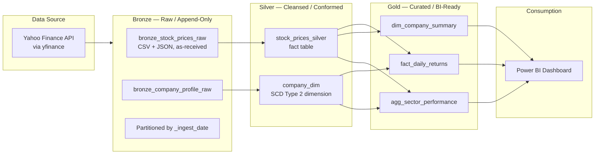

# Stock Market Medallion Pipeline

An end-to-end **Lakehouse** data engineering project that ingests five years of daily stock price
data for ten large-capitalization U.S. companies, then progressively refines that data through a
**Medallion Architecture** (Bronze → Silver → Gold) implemented with **Apache Spark on Databricks
Community Edition**. The curated Gold layer feeds a Power BI dashboard for price-trend analysis,
sector performance comparison, and top gainers/losers reporting.

The data source is the [Yahoo Finance](https://finance.yahoo.com/) public quote service, accessed
via the [`yfinance`](https://pypi.org/project/yfinance/) Python library — **no API key, account, or
paid subscription required**, which keeps the entire project inside the free Databricks CE tier.

---

## Table of Contents

- [Project Status](#project-status)
- [Architecture](#architecture)
- [Tech Stack](#tech-stack)
- [Dataset Scope](#dataset-scope)
- [Repository Structure](#repository-structure)
- [Getting Started](#getting-started)
- [Running the Pipeline](#running-the-pipeline)
- [Data Model](#data-model)
- [Dashboard](#dashboard)
- [Design Decisions](#design-decisions)
- [Team](#team)
- [License](#license)

---

## Project Status

| Phase | Status |
| --- | --- |
| **Phase 1 — Proposal** | **Ready** — formal proposal in [`docs/project-proposal.md`](docs/project-proposal.md), sample full/incremental payloads in [`sample_data/`](sample_data/) |
| **Phase 2 — Pipeline** | Planned — PySpark notebooks/scripts under `bronze/`, `silver/`, `gold/` |
| **Phase 3 — Dashboard** | Planned — Power BI report per [`dashboard/dashboard_spec.md`](dashboard/dashboard_spec.md) |

> Pipeline code is specified in this README and implemented incrementally in Phase 2 so each layer
> is developed, run, and committed in turn.

---

## Architecture

The pipeline follows the **Medallion (lakehouse) Architecture**, where each layer adds a distinct
quality guarantee and is immutable once written.



### Layer contracts

| Layer | Format | Write pattern | Guarantee | Table(s) |
| --- | --- | --- | --- | --- |
| **Bronze** | CSV + JSON | Append-only, partitioned by `_ingest_date` | Fidelity — exactly as received, no filtering | `bronze_stock_prices_raw`, `bronze_company_profile_raw` |
| **Silver** | Parquet (Unity Catalog) | Overwrite / merge | Accuracy — typed, deduplicated, referentially complete | `stock_prices_silver`, `company_dim` |
| **Gold** | Delta tables | Overwrite + partition by `trade_date` | Presentation — business logic and KPIs pre-computed | `fact_daily_returns`, `agg_sector_performance`, `dim_company_summary` |

**Idempotency rule:** Bronze is append-only and never updated. Silver and Gold are fully rebuilt
(or `MERGE`d) on each run, so re-running any load produces identical results and cannot duplicate
rows. This is what makes the incremental job safe to retry.

---

## Tech Stack

| Component | Technology |
| --- | --- |
| Compute | Apache Spark 3.5 (Databricks Community Edition, serverless / community cluster) |
| Platform | Databricks Community Edition — free tier |
| Ingestion | Python 3.10+, `yfinance` |
| Storage | Delta Lake / Apache Parquet on DBFS (or Unity Catalog volumes) |
| Transformation | PySpark DataFrame API + Spark SQL |
| Orchestration | Databricks Jobs, `dbutils.notebook.task`, scheduled daily job |
| Version control | Git + GitHub |
| BI | Microsoft Power BI (DirectQuery / CSV / Parquet export) |
| Visualization | Matplotlib / Plotly for notebook output |
| License | MIT |


---

## Dataset Scope

### Tracked tickers and sectors

Ten companies chosen to span six GICS-style sectors, so the sector comparison in the Gold layer
is meaningful rather than single-sector.

| Ticker | Company | Sector |
| --- | --- | --- |
| AAPL | Apple Inc. | Information Technology |
| MSFT | Microsoft Corporation | Information Technology |
| NVDA | NVIDIA Corporation | Information Technology |
| GOOGL | Alphabet Inc. (Class A) | Communication Services |
| DIS | The Walt Disney Company | Communication Services |
| AMZN | Amazon.com, Inc. | Consumer Discretionary |
| TSLA | Tesla, Inc. | Consumer Discretionary |
| JPM | JPMorgan Chase & Co. | Financials |
| PG | The Procter & Gamble Company | Consumer Staples |
| XOM | Exxon Mobil Corporation | Energy |

### Full-load volume

- **Frequency:** daily OHLCV bars
- **History:** 5 years (~1,250 trading days per ticker)
- **Expected Bronze volume:** ~12,500 price rows per full load
- **Incremental volume:** 1 new row per ticker per trading day (~10 rows/day)
- **Expected Gold `fact_daily_returns` size:** ~12,500 rows

### Privacy and compliance

The dataset contains **no PII and no personally identifiable information of any kind.** It consists
exclusively of publicly traded market prices and publicly published company reference data
(sector, industry, employee counts, headquarters). No user records, credentials, or free-text
fields are collected, so no anonymization or redaction step is required. This is documented here to
satisfy academic data-governance requirements.

### Raw schema (as received from Yahoo Finance)

| Field | Type | Notes |
| --- | --- | --- |
| `Date` | date | Trading day |
| `Open` | float | Opening price |
| `High` | float | Intraday high |
| `Low` | float | Intraday low |
| `Close` | float | Closing price |
| `Adj Close` | float | Split/dividend-adjusted close |
| `Volume` | int | Shares traded |
| `Dividends` | float | Often `0.0` — present in the raw frame |
| `Stock Splits` | float | Often `0.0` — present in the raw frame |

> `Dividends` and `Stock Splits` are captured in Bronze for traceability but are not promoted to
> the Silver fact table, since the project's analytical grain is price behaviour.

---

## Repository Structure

```
dav-medallion-pipeline/
├── README.md                       # This file
├── LICENSE                         # MIT
├── requirements.txt                # Python dependencies (yfinance, etc.)
├── .gitignore                      # Spark, Python, and Databricks artifacts
├── docs/
│   ├── project-proposal.md         # Original academic project proposal
│   ├── data-dictionary.md          # Full column-level dictionary
│   ├── data-quality.md             # Validation rules and thresholds
│   └── screenshots/                # Dashboard and notebook output images
│
├── bronze/                         # Raw ingestion — append-only
│   ├── 01_ingest_full_load.py      # 5-year historical backfill
│   ├── 02_ingest_incremental.py    # Daily incremental append
│   ├── 03_ingest_company_profile.py
│   └── README.md
│
├── silver/                         # Cleansing and conformance
│   ├── 01_build_stock_prices_silver.py
│   ├── 02_build_company_dim.py
│   ├── 03_data_quality_checks.py
│   └── README.md
│
├── gold/                           # Business logic and KPIs
│   ├── 01_build_fact_daily_returns.py
│   ├── 02_build_agg_sector_performance.py
│   ├── 03_build_dim_company_summary.py
│   └── README.md
│
├── notebooks/                      # Exploratory analysis and prototypes
│   ├── eda_price_trends.ipynb
│   ├── eda_sector_analysis.ipynb
│   └── eda_return_distribution.ipynb
│
├── dashboard/                      # Power BI assets
│   ├── StockMarketDashboard.pbix
│   ├── measure_definitions.md      # DAX measures used in the report
│   ├── dashboard_spec.md           # Page-by-page layout spec
│   └── export/                     # CSV / Parquet extracts consumed by Power BI
│       └── .gitkeep
│
└── sample_data/                    # Phase 1 committed raw payloads
    ├── full_load_sample.csv        # Full-load payload (5y × 10 tickers)
    ├── incremental_load_sample.csv # Incremental payload (recent days)
    ├── company_profile_sample.json
    ├── bronze_sample.csv
    ├── silver_sample.csv
    └── README.md
```

**Naming conventions**

- Notebooks and scripts are numbered with a two-digit prefix so the intended execution order is
  explicit in the file browser: `01_...` runs before `02_...`.
- Layer folder names are lowercase and match the medallion layer they build.
- Table names use `snake_case`; fact tables are prefixed `fact_` and conformed dimensions `dim_`.

---

## Getting Started

### Prerequisites

- A [Databricks Community Edition](https://databricks.com/learn/resources/community-edition)
  account (free — requires a business email to sign up)
- Git installed locally
- Python 3.10+ (only needed if you ingest outside of Databricks)

### 1. Clone the repository

```bash
git clone https://github.com/YOUR_USERNAME/dav-medallion-pipeline.git
cd dav-medallion-pipeline
```

**Phase 1 submission:** use [`docs/project-proposal.md`](docs/project-proposal.md) as your formal proposal (export to PDF if required) and submit this repository URL.

### 2. Create the catalog and schemas

Run this once in a Databricks notebook, or as a SQL query in a SQL warehouse. Unity Catalog
(available on CE) gives you fine-grained access control and `DROP TABLE IF EXISTS` safety that
Hive metastore does not.

```sql
CREATE CATALOG IF NOT EXISTS dav;
CREATE SCHEMA IF NOT EXISTS dav.bronze;
CREATE SCHEMA IF NOT EXISTS dav.silver;
CREATE SCHEMA IF NOT EXISTS dav.gold;
```

### 3. Install Python dependencies

On a Databricks cluster, add to the cluster's *Libraries* tab (PyPI):

```
yfinance==0.2.51
pandas==2.2.2
```

Or in a notebook:

```python
%pip install yfinance==0.2.51 pandas==2.2.2
```

The local `requirements.txt` mirrors this for running ingestion outside Databricks.

### 4. Register the repo as a Databricks project

**Workspace → Repos → Add repo → GitHub**, then clone `dav-medallion-pipeline` into the workspace.
The `/bronze`, `/silver`, and `/gold` folders appear in the Repos tree and can be run as
notebooks directly from the Databricks UI.

### 5. Verify connectivity

```python
import yfinance as yf

tickers = ["AAPL", "MSFT", "GOOGL", "AMZN", "TSLA", "NVDA", "JPM", "XOM", "PG", "DIS"]
df = yf.download(tickers, start="2020-01-01", end="2024-01-01", progress=False)
print(df.shape)
print(df.head())
```

If this returns rows, ingestion will work.

> **Rate limiting:** Yahoo Finance throttles unauthenticated clients. Ingestion uses a
> `time.sleep()` delay between ticker requests and is configured for a single-node cluster to
> reduce the chance of being throttled. If you see empty frames, wait a few minutes and re-run.

---

## Running the Pipeline

### Full load vs. incremental load

| | Full Load | Incremental Load |
| --- | --- | --- |
| **Script** | `bronze/01_ingest_full_load.py` | `bronze/02_ingest_incremental.py` |
| **Date range** | 5 years back from today | Last successful `_ingest_date` → today |
| **Mode** | `yf.download(..., period="5y")` | `yf.download(..., start=last_date)` |
| **Bronze write** | Append | Append |
| **Downstream** | Silver + Gold full rebuild | Silver `MERGE` + Gold `MERGE` on new dates |
| **When to run** | Once, to initialize | Daily, scheduled 21:00 UTC (after US close) |
| **Runtime** | ~3–5 min (10 tickers) | ~15–30 s |

### Full load (run once)

```python
# bronze/01_ingest_full_load.py
import yfinance as yf
import time
from datetime import datetime, timezone
from pyspark.sql import functions as F
from pyspark.sql.types import *

TICKERS = ["AAPL", "MSFT", "GOOGL", "AMZN", "TSLA", "NVDA", "JPM", "XOM", "PG", "DIS"]
BRONZE_PATH = "s3://dav-bucket/bronze/stock_prices"

price_schema = StructType([
    StructField("trade_date",  DateType(),    True),
    StructField("ticker",      StringType(), True),
    StructField("open",        DoubleType(), True),
    StructField("high",        DoubleType(), True),
    StructField("low",         DoubleType(), True),
    StructField("close",       DoubleType(), True),
    StructField("adj_close",   DoubleType(), True),
    StructField("volume",      LongType(),   True),
    StructField("ingested_at", TimestampType(), True),
    StructField("_ingest_date", DateType(),  True),
])

for ticker in TICKERS:
    raw = yf.download(ticker, period="5y", progress=False, auto_adjust=False)
    if raw is None or raw.empty:
        print(f"[WARN] No data returned for {ticker}")
        continue

    df = raw.reset_index()
    df.columns = [c.lower().replace(" ", "_") for c in df.columns]
    df = (df
          .rename(columns={"adj_close": "adj_close", "index": "trade_date"})
          .assign(ticker=ticker)
          .withColumn("ingested_at", F.current_timestamp())
          .withColumn("_ingest_date", F.current_date()))

    df = df.select(
        F.col("trade_date").cast("date").alias("trade_date"),
        "ticker",
        F.col("open").cast("double"),
        F.col("high").cast("double"),
        F.col("low").cast("double"),
        F.col("close").cast("double"),
        F.col("adj_close").cast("double"),
        F.col("volume").cast("long"),
        "ingested_at",
        "_ingest_date",
    )

    (df.write
       .mode("append")
       .format("delta")
       .option("mergeSchema", "true")
       .save(BRONZE_PATH))

    print(f"[OK] {ticker}: {df.count()} rows")
    time.sleep(2)  # be polite to Yahoo Finance
```

```bash
databricks notebooks run \
  --repo-path "/Workspace/dav-medallion-pipeline" \
  bronze/01_ingest_full_load.py
```

### Incremental load (daily, scheduled)

```python
# bronze/02_ingest_incremental.py — key logic
last_ingest = (spark.table(BRONZE_PATH)
               .agg(F.max("_ingest_date").alias("last_date"))
               .collect()[0]["last_date"])

start = last_ingest + timedelta(days=1) if last_ingest else date.today() - timedelta(days=5)
print(f"Fetching {start} -> {date.today()}")

raw = yf.download(TICKERS, start=start.isoformat(), progress=False, auto_adjust=False)
# ... same normalization as the full load, then append ...
```

Because Bronze is append-only and Silver/Gold are `MERGE`d on `(trade_date, ticker)`, re-running an
incremental job for a date that was already loaded is **safe** — no duplicate rows appear in the
Silver fact table.

### Orchestrated daily job

Create a Databricks Job with the task sequence:

```
Task 1: 02_ingest_incremental  (bronze)   →  Task 2: 01_build_stock_prices_silver
Task 3: 02_build_company_dim  (silver)   →  Task 4: 03_build_fact_daily_returns
Task 5: 02_build_agg_sector_performance   →  Task 6: 03_build_dim_company_summary
```

Schedule: **Daily at 21:00 UTC, Monday–Friday** (after the 20:00 UTC US market close). Enable
"retry on failure" with 2 attempts and alert the team on permanent failure.

```python
# Simplification of silver/01_build_stock_prices_silver.py
bronze = (spark.read.format("delta").load(BRONZE_PATH)
          .filter(F.col("_ingest_date") >= F.lit(F.current_date() - 7)))

silver = (bronze
    .withColumn("ticker", F.upper(F.trim(F.col("ticker"))))
    .withColumn("currency", F.lit("USD"))
    .dropDuplicates(["trade_date", "ticker"])
    .withColumn("open", F.round(F.col("open"), 4))
    .withColumn("high", F.round(F.col("high"), 4))
    .withColumn("low",  F.round(F.col("low"), 4))
    .withColumn("close", F.round(F.col("close"), 4))
    .dropna(subset=["trade_date", "ticker", "open", "high", "low", "close", "volume"]))

(silver.write
       .mode("overwrite")
       .format("delta")
       .option("overwriteSchema", "true")
       .partitionBy("trade_date")
       .save(SILVER_PATH))
```

### Run order (end to end)

```
1. bronze/01_ingest_full_load.py          # once, to initialize
2. bronze/03_ingest_company_profile.py    # once
3. silver/01_build_stock_prices_silver.py
4. silver/02_build_company_dim.py
5. silver/03_data_quality_checks.py       # validation gate
6. gold/01_build_fact_daily_returns.py
7. gold/02_build_agg_sector_performance.py
8. gold/03_build_dim_company_summary.py
9. dashboard/export/                      # publish for Power BI
```

---

## Data Model

### Silver — `stock_prices_silver` (fact)

One row per ticker per trading day. Appended incrementally, deduplicated on `(trade_date, ticker)`.

| Column | Type | Description | Nulls allowed |
| --- | --- | --- | --- |
| `trade_date` | DATE | Trading day | No |
| `ticker` | STRING | Upper-case ticker symbol | No |
| `open` | DOUBLE | Opening price, USD | No |
| `high` | DOUBLE | Intraday high, USD | No |
| `low` | DOUBLE | Intraday low, USD | No |
| `close` | DOUBLE | Closing price, USD | No |
| `adj_close` | DOUBLE | Split/dividend-adjusted close, USD | Yes |
| `volume` | BIGINT | Shares traded | No |
| `currency` | STRING | ISO code, always `USD` | No |
| `source` | STRING | Provenance, always `yfinance` | No |
| `ingested_at` | TIMESTAMP | UTC time the row entered Bronze | No |
| `silver_loaded_at` | TIMESTAMP | UTC time the Silver row was written | No |

**Key:** `trade_date`, `ticker`
**Partitioned by:** `trade_date`
**Expected size:** ~12,500 rows

### Silver — `company_dim` (dimension, SCD Type 2)

| Column | Type | Description |
| --- | --- | --- |
| `ticker` | STRING | Natural key |
| `company_name` | STRING | Full legal name |
| `sector` | STRING | GICS-style sector (6 distinct values) |
| `industry` | STRING | GICS-style industry |
| `country` | STRING | Country of incorporation |
| `website` | STRING | Corporate website |
| `employees` | INT | Approximate headcount |
| `valid_from` | DATE | Start of the validity interval |
| `valid_to` | DATE | End of the validity interval, `9999-12-31` for current |
| `is_current` | BOOLEAN | `true` for the current version |
| `last_updated` | TIMESTAMP | Load timestamp |

**Key:** `ticker` + `valid_from`. Current rows filtered with `is_current = true`.

### Gold — `fact_daily_returns`

The primary analytical table. One row per ticker per trading day, enriched with return and
rolling-window metrics computed with window functions.

| Column | Type | Description |
| --- | --- | --- |
| `trade_date` | DATE | Trading day |
| `ticker` | STRING | Ticker symbol |
| `company_name` | STRING | Denormalized from `company_dim` |
| `sector` | STRING | Denormalized from `company_dim` |
| `close` | DOUBLE | Closing price |
| `prev_close` | DOUBLE | Prior day's close (`LAG`) |
| `daily_return` | DECIMAL(10,6) | Fractional return, e.g. `0.0125` = +1.25% |
| `daily_return_pct` | DECIMAL(10,4) | Percentage return |
| `cum_return` | DECIMAL(10,6) | Cumulative return since the first loaded date |
| `ma_20` | DOUBLE | 20-day simple moving average |
| `ma_50` | DOUBLE | 50-day simple moving average |
| `volatility_20d` | DECIMAL(10,6) | 20-day rolling standard deviation of returns |
| `volume` | BIGINT | Shares traded |
| `is_at_52w_high` | BOOLEAN | Close is within 1% of its 52-week high |

**Key:** `trade_date`, `ticker`

### Gold — `agg_sector_performance`

Sector-level daily rollup that drives the dashboard heatmap.

| Column | Type | Description |
| --- | --- | --- |
| `trade_date` | DATE | Trading day |
| `sector` | STRING | Sector name |
| `member_count` | INT | Number of tracked tickers in the sector |
| `avg_daily_return_pct` | DECIMAL(10,4) | Mean daily return across members |
| `total_volume` | BIGINT | Aggregate shares traded |
| `advancing_count` | INT | Members with a positive return |
| `declining_count` | INT | Members with a negative return |
| `best_ticker` | STRING | Top-performing member that day |
| `worst_ticker` | STRING | Worst-performing member that day |
| `sector_return_rank` | INT | Rank of the sector's return that day, `1` = best |

**Key:** `trade_date`, `sector`

### Gold — `dim_company_summary`

Company-level all-time and recent aggregates powering the leaderboard pages.

| Column | Type | Description |
| --- | --- | --- |
| `ticker` | STRING | Ticker symbol |
| `company_name` | STRING | Full legal name |
| `sector` | STRING | Sector |
| `first_trade_date` | DATE | Earliest date in the fact table |
| `last_trade_date` | DATE | Most recent date in the fact table |
| `trading_days` | INT | Count of daily observations |
| `avg_close` | DOUBLE | Mean closing price over the window |
| `total_return_pct` | DECIMAL(10,4) | Total return across the full window |
| `annualized_return_pct` | DECIMAL(10,4) | CAGR over the window |
| `annualized_volatility` | DECIMAL(10,6) | `stddev(daily_return) × √252` |
| `max_drawdown` | DECIMAL(10,6) | Largest peak-to-trough decline |
| `best_day_pct` | DECIMAL(10,4) | Largest single-day gain |
| `worst_day_pct` | DECIMAL(10,4) | Largest single-day loss |
| `total_volume` | BIGINT | Cumulative shares traded |
| `return_rank` | INT | Rank by total return, `1` = best |

**Key:** `ticker`

### Entity relationships

```
company_dim (SCD2)
     │  1
     │
     │  many
     ▼
stock_prices_silver ──────────► fact_daily_returns
     │                              │
     │                              ▼
     └──────────────────────► agg_sector_performance
                                    │
                                    ▼
                            dim_company_summary
```

---

## Dashboard

The Power BI report consumes the Gold layer and is organised into four pages.

| Page | Content | Visual |
| --- | --- | --- |
| **Price Trends** | Close price over time for all 10 tickers, with 20/50-day moving averages | Line chart, ticker slicer |
| **Sector Performance** | Average daily return by sector over time; relative strength | Heatmap matrix, heat-enabled table |
| **Top Gainers / Losers** | Best and worst performers for a selected day, window, or month | Ranked bar charts |
| **Company Summary** | Total return, volatility, and max drawdown per company | Scatter (return vs. volatility), KPI cards |

**DAX measures defined in the report**

```dax
Total Return %       = DIVIDE([cum_return_max] - 1, 1)
Avg Daily Return %   = AVERAGE(fact_daily_returns[daily_return_pct])
Volatility (Ann.)    = STDEV.S(fact_daily_returns[daily_return]) * SQRT(252)
Sector Avg Return    = AVERAGE(agg_sector_performance[avg_daily_return_pct])
Advancing Members    = SUM(agg_sector_performance[advancing_count])
Top Ticker           = TOPN(1, ALL(fact_daily_returns), fact_daily_returns[daily_return_pct], DESC)
```

Because `daily_return_pct` is pre-computed in the Gold layer, most measures are simple
aggregations — the heavy lifting happens in Spark, not in the report.

### Connecting Power BI

1. Export the Gold tables to CSV via a Databricks notebook, or
2. Publish the Gold tables to a shared location and use the Power BI **Parquet** connector, or
3. Query via a Databricks SQL warehouse and connect with the **Databricks** connector in DirectQuery mode.

The `dashboard/export/` folder holds small committed extracts so the report layout can be reviewed
without a live cluster.

---

## Design Decisions

**Why the Medallion Architecture?** Each layer's schema is fit for a single purpose, so raw
ingestion is never coupled to reporting changes. A bug in the Gold logic can be fixed by rerunning
one Gold notebook without re-hitting the Yahoo Finance rate limit.

**Why keep the raw `Dividends` and `Stock Splits` columns in Bronze?** Reproducibility. If the
project later adds dividend-adjusted total-return analysis, the data is already there and no
re-ingestion is needed.

**Why full-load plus incremental instead of full-load only?** A full re-download of five years for
ten tickers is slow and, at Yahoo Finance's rate limits, fragile. The daily job fetches only new
bars, cutting Bronze ingestion to ~30 seconds.

**Why is Bronze append-only?** Raw data should be an immutable record of what the source returned
at a point in time. Overwriting Bronze would destroy the ability to explain a downstream
discrepancy. Deduplication is handled one layer up, in Silver, using a `MERGE` on
`(trade_date, ticker)`.

**Why an SCD Type 2 `company_dim` rather than a static table?** Yahoo Finance periodically
reclassifies a company's sector or industry. Storing validity intervals means a historical return
computed after a reclassification is still attributable to the correct sector, which keeps the
sector heatmap historically accurate.

**Why 252 trading days for annualization?** 365 minus roughly 104 weekend days and 9 market
holidays. Using it in the volatility formula makes the annualized figure comparable across tickers.

**How is the community/free-tier limit respected?** One single-node cluster with auto-termination
after 20 minutes, Bronze stored as compressed CSV/JSON, Silver and Gold as Delta with Snappy
compression, and partition pruning on `trade_date`. The full dataset is small enough to fit well
inside the free tier; the design would be revisited only if the ticker count grew substantially.

### Data quality rules

Enforced in `silver/03_data_quality_checks.py`; a failure blocks promotion to Gold.

| Rule | Check | Action on failure |
| --- | --- | --- |
| Uniqueness | No duplicate `(trade_date, ticker)` in Silver | `MERGE` de-duplicates; alert if > 0 duplicates persist |
| Completeness | `close`, `open`, `high`, `low`, `volume` not null | Rows with null price dropped and counted |
| Validity | `low <= open <= high`, `low <= close <= high` | Offending rows quarantined to `silver/_quarantine` |
| Non-negative | `volume >= 0` | Negative values set to null and logged |
| Referential | Every `ticker` in the fact table exists in `company_dim` | Unmatched tickers quarantined |
| Freshness | Gold contains data for the latest completed trading day | Job marked failed; alert raised |
| Row count | Daily row count matches the number of traded tickers | Warning logged |

---

## Team

| Name | Role | Responsibilities |
| --- | --- | --- |
| **Haider Ali** | Data Engineer — Ingestion & Bronze | `yfinance` integration, full/incremental load logic, Bronze partitioning, rate-limit handling, Databricks environment setup |
| **Ali Naveed** | Data Engineer — Transformation & Analytics | Silver cleansing and SCD2 dimension, Gold aggregations and window functions, data quality rules, Power BI dashboard |

**Project:** Data Engineering semester project — Lakehouse pipelines with the Medallion Architecture
**Stack:** Apache Spark on Databricks Community Edition

---

## License

This project is licensed under the **MIT License**.

```
MIT License

Copyright (c) 2026 Haider Ali, Ali Naveed

Permission is hereby granted, free of charge, to any person obtaining a copy
of this software and associated documentation files (the "Software"), to deal
in the Software without restriction, including without limitation the rights
to use, copy, modify, merge, publish, distribute, sublicense, and/or sell
copies of the Software, and to permit persons to whom the Software is
furnished to do so, subject to the following conditions:

The above copyright notice and this permission notice shall be included in all
copies or substantial portions of the Software.

THE SOFTWARE IS PROVIDED "AS IS", WITHOUT WARRANTY OF ANY KIND, EXPRESS OR
IMPLIED, INCLUDING BUT NOT LIMITED TO THE WARRANTIES OF MERCHANTABILITY,
FITNESS FOR A PARTICULAR PURPOSE AND NONINFRINGEMENT. IN NO EVENT SHALL THE
AUTHORS OR COPYRIGHT HOLDERS BE LIABLE FOR ANY CLAIM, DAMAGES OR OTHER
LIABILITY, WHETHER IN AN ACTION OF CONTRACT, TORT OR OTHERWISE, ARISING FROM,
OUT OF OR IN CONNECTION WITH THE SOFTWARE OR THE USE OR OTHER DEALINGS IN THE
SOFTWARE.
```

Data is provided by Yahoo Finance via the `yfinance` library and is used for **educational and
academic purposes only**. Yahoo Finance retains all rights to the underlying market data.
